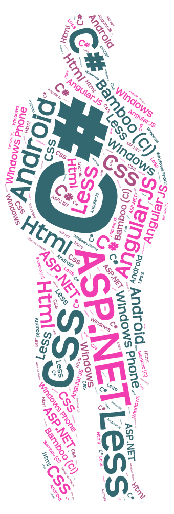

## Jeroen Heijster

## Me

In my study, work and internship I have shown dedication to what I do. I excel in what I do and are eager to learn how to do better. In the past I have worked at a business support desk troubleshooting, solving complex problems and communicating. I work best under pressure and I love working in a team as well as working alone at times. I am also flexible and detail orientated.According to others I am a tech savvy individual with amazing social media skills and I am very detail oriented. I am also a very diligent student who will try to achieve perfection.

While Java was the primary programming language at school, I have taught myself C#, Android, Windows Phone, ASP.NET and PHP. As a web developer I also have a lot of experience with CSS, HTML and JavaScript. I also have knowledge of several operating systems. Windows 95-8 and several Linux distributions like Fedora Core, CentOS, Sabayon, Ubuntu and Debian.
