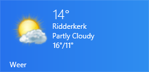

Windows 8 will launch in less than a month. Still, it has received a lot of negative messages from, for example, Steam and Notch. I have been using it for more than a month now so I have enough experience with the platform now.

# What's new?

## Windows RT applications

Windows 8 now features a shop. Here you can download and buy applications that integrate into the new system better. The nice thing is that the applications will not run in the background. It will be suspended whenever it is not on the foreground. Through special background tasks, it can still work. This way, the application can still notify you of new mails, tweets, etc. This should save your battery.

## Start screen

### Live tiles

Windows 8's main change is the start screen. Like Windows Phone, it now features tiles.

The nice thing about live tiles is that it offers information much quicker than standard notifications. You open your start menu and you see all notifications from the apps itself. For example, it an show you the weather, if you have available e-mails, if you have new messages, etc.

 

## Charms

Another new feature is the Charms bar. From the desktop and all Windows RT applications, you can access the Charms bar. Through this you always have the options shown on the left.

With **search** you can look for applications you have installed, the settings, files and you can search in the different Windows RT applications you've installed.

**Share** gives you the options to share different data. For example, from Internet Explorer you could share the link, from Email you could share selected text and in the applications the developer can select what can be shared.

**Devices** quickly gives you device options. In my case, it will give me options to set second monitor options.

**Settings** will give you the Windows RT application settings. In the desktop environment it will give you options to go to control panel, etc.

 

 

 

 

## Speed

Windows 8 actually improved the speed of the desktop as well. I noticed that more resource heavy applications run more smoothly and games worked smoother too.

## Lock screen

Another new feature is the lock screen. Not only does it show a nice picture, it also shows notification icons.

For security, you can use a password, a 4 digit pin code or even gestures on a picture.

 

## Conclusion

Of course, there are more features. It has redesigned the desktop look, no more transparent Aero, it has been replaced by a cleaner look. The task manager has been changed to show more details and a lot more.

I don't think Windows 8 is bad at all. It just takes some time getting used to. I admit that I didn't like it at first but it has grown on me. I like it this way and I will continue using it.
