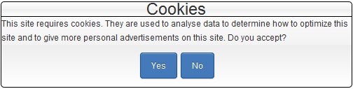

Dutch law states that before a cookie is even placed on someone's computer, you need their consent. The problem is that other EU countries only require you to notify them and remove the cookies if the user disagrees. The big difference is when the cookie may be placed.

Due to this, the Wordpress plugins that were available do not comply to the standards in the Netherlands. This plugin will just show a warning when loading the page if the user hasn't agreed to it earlier.

#### [Download from wordpress.org](http://wordpress.org/extend/plugins/cookie-consent/)

 

## [Feel free to donate.](http://www.jeroenheijster.com/donate/)
