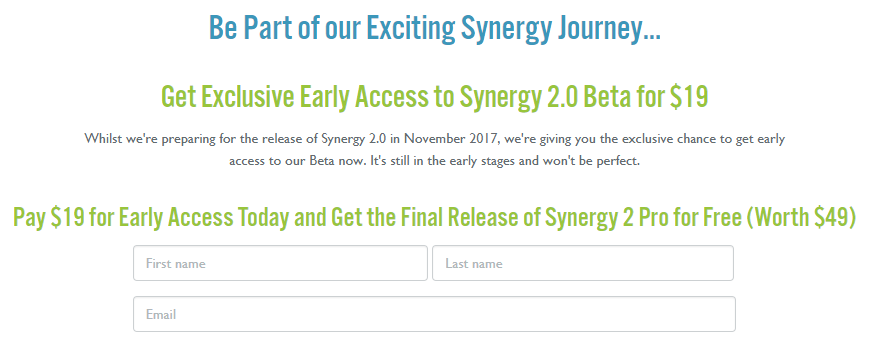
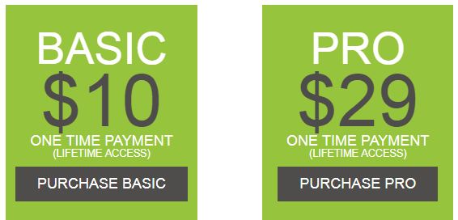
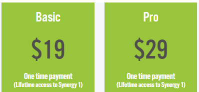

_While I love the thought of lifetime access to software, it always poses a bit of a problem. Long-term development._

I love the idea of lifetime access to software. From Malwarebytes to Bandicam and Synergy by Symless. You pay once and get all updates for free. The problem comes when the company runs out of money or is close to that.

Yesterday I woke up to find out software I use, Synergy, has an upgrade offer:

\[caption id="attachment\_12058" align="alignnone" width="871"\] PAY US for a FREE update\[/caption\]

Basically, they're saying _pay now and get a free update later_. While this may sound nice when you glance over it, the moment you think about it, you realize that you're just pre-ordering at a discount.

The problem was though, that I know it was listed as lifetime before, I went to their site and indeed, it now lists purchases for v1.x only. Just to make sure I wasn't crazy, I set the [wayback machine to 2015](https://web.archive.org/web/20151205154613/https://synergy-project.org/pricing), the year I purchased it. I was not completely surprised that it did say **lifetime** access there and that it was a **one time payment**.

\[caption id="attachment\_12053" align="alignnone" width="566"\] Old pricing\[/caption\]

\[caption id="attachment\_12054" align="alignnone" width="398"\] New pricing\[/caption\]

I also went digging into the site through the wayback machine and could not find any hints that this was only for v1.x.

So I searched on Twitter if people have reported this before. Someone else had also reported this. After tweeting them the following and getting a reply:

 

<blockquote class="twitter-tweet" data-lang="en">
Hey Jeroen, we've sent you an email!
— Symless (@Symless) <a href="https://twitter.com/Symless/status/908275070795120640">September 14, 2017</a></blockquote>

After searching my mail accounts, since it was sent to the wrong e-mail account (I have a pro license and a basic license on different accounts, they sent it to the one I have the basic on), it took me a while to find the mail. What I received in the mail was an apology because they "didn't make it clear from the start". They gave my access to their "new" Synergy 2 Pro product for free. While this initially seem like a good offer, the same issue will happen with version 3 and onwards.

The problem with changing it from lifetime to "lifetime" for this major version is that they did it without informing us and NOT grandfathering us into a real lifetime option. I understand that they also need to make money, but this is NEVER a good idea.

It's almost like selling me a lifetime supply of donuts, that I come back after a year and the vendor saying "oh sorry, that's no longer valid, we added sprinkles on the donuts so it's a totally different product now".

We've seen the backlash that, for example, Roboform got when they no longer honored their lifetime licenses, same with Cerberus (although those lifetime licenses were given out as a promotion, they offered a paid upgrade to keep it as a lifetime license). Malwarebytes on the other hand actually honored the old licenses and simply stopped selling them.
